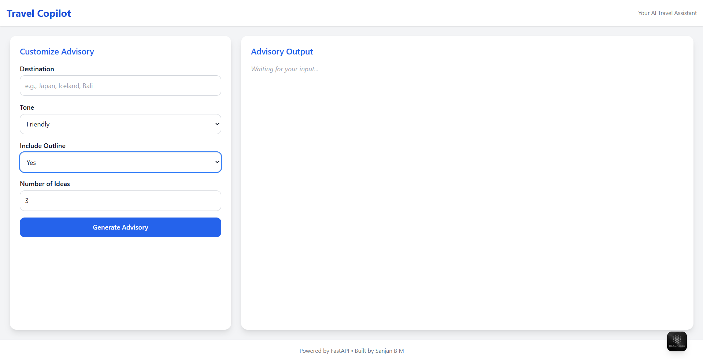

# Travel Advisory Generator – Travel Copilot

An AI-powered Travel Advisory Generator with a sleek, Copilot-inspired interface. Built using **FastAPI** for the backend and **Tailwind CSS** for the frontend, this app helps users generate clear, tailored travel advisories based on customizable parameters.

## Features

- Customizable advisory generation (niche, tone, outline type, number of ideas)
- Copilot-style responsive UI with chat-inspired result layout
- Fast, modern web experience with Tailwind CSS
- Animated loading and smooth interaction feedback
- Fully responsive for both desktop and mobile users

## Tech Stack

| Layer     | Technology                     |
| --------- | ------------------------------ |
| Frontend  | HTML, Tailwind CSS, JavaScript |
| Backend   | FastAPI                        |
| API Model | OpenAI / GPT-based models      |

---

## Installation

### 1. Clone the repository

```bash
git clone https://github.com/yourusername/travel-advisory-ui.git
cd travel-advisory-ui
```

### 2. Set up Python backend

```bash
# Create virtual environment
python -m venv venv
source venv/bin/activate   # or venv\Scripts\activate on Windows

# Install dependencies
pip install -r requirements.txt
```

### 3. Run the FastAPI server

```bash
uvicorn main:app --reload
```

### 4. Open the frontend

- Open `index.html` in your browser
- Make sure the FastAPI server is running to receive advisory results

---

## Usage

1. Fill in the form with:

   - Your niche or travel context
   - Desired tone (friendly, professional, etc.)
   - Outline style (bulleted, detailed, summary)
   - Number of advisories to generate

2. Click “Generate Advisory”
3. Wait for the result to appear on the right, chat-style.

---

## 🖼 Screenshot

> _(Include a screenshot of the interface here for a better first impression)_
> Example:
> 

---

## Project Structure

```bash
📁 travel-advisory-ui
│
├── index.html         # Frontend HTML
├── styles.css         # Tailwind CSS (if used separately)
├── script.js          # Client-side JS (optional)
├── main.py            # FastAPI backend
├── requirements.txt   # Python dependencies
└── README.md          # Project documentation
```

---

## Contributing

1. Fork this repository
2. Create a new branch: `git checkout -b feature-name`
3. Commit your changes: `git commit -m "Added new feature"`
4. Push to the branch: `git push origin feature-name`
5. Open a Pull Request

---

## License

MIT License – feel free to use, modify, and distribute for both personal and commercial projects.

---

## Acknowledgements

- OpenAI for the underlying GPT models
- Tailwind CSS for the fast and clean UI development
- FastAPI for a lightning-fast Python backend

---

> Designed and developed to make travel planning smarter and simpler.
